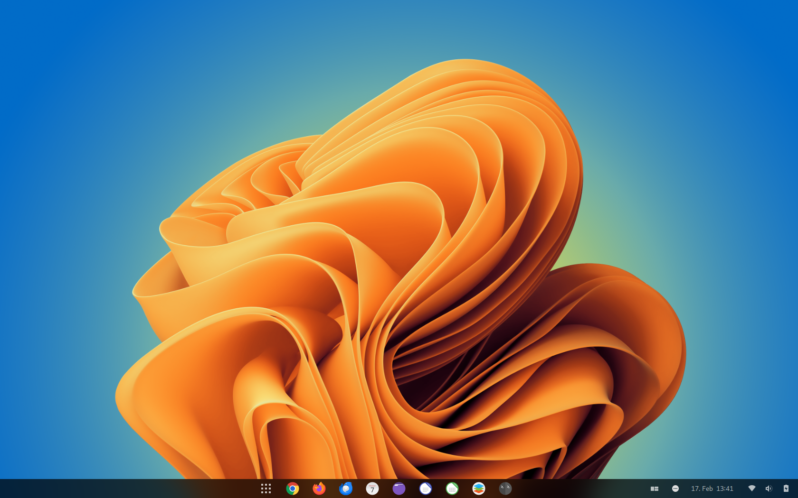
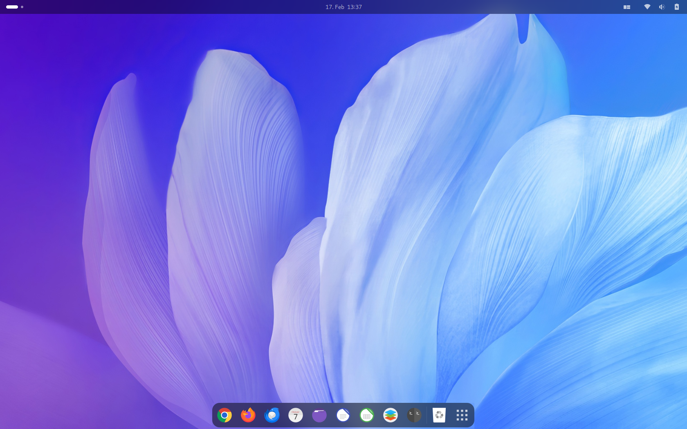
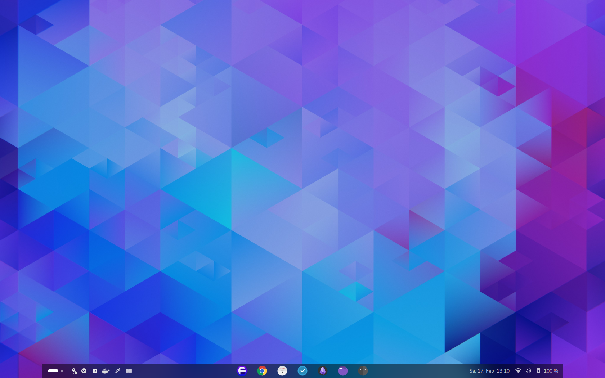

# Linux im Alltag - Arbeitsplatz

Der LIA Arbeitsplatz basiert auf der Fedora Workstation Edition.  Der Arbeitsplatz nutzt den Gnome Desktop mit Erweiterungen die wichtige Funktionen dem Gnome Desktop hinzufügen.

=== "Windows Layout"
    {data-gallery="LIAA"}

=== "Mac Layout"
    {data-gallery="LIAA"}

=== "Custom Layout"
    {data-gallery="LIAA"}

## Genutzte Erweiterungen

Die Erweiterungen lassen sich in die folgenden Kategorien aufteilen:

### Funktionalität

Diese Erweiterungen fügen neue oder erweiterte Funktionen hinzu.

- Pop-Shell (Tiling Window Manager)
- KstatusNotifierSupport (Status Icons)
- Clipboard Indicator (Manage das Clipboard)

### Verhalten

Diese Erweiterungen ändern oder fügen ein neues Verhalten zum Desktop hinzu.

- Dash to Dock (Mac OSx ähnlich Leisten)
- Dash to Panel (Windows 10/11 ähnliche Leiste)
- Quick Settings Tweaker (Räumt das Quicksettings-Menü auf)

### Aussehen

Erweiterungen die das Aussehen des Gnome Desktops verändern oder weitern

- Blur my Shell (Macht den Desktop hübscher)
- Burn my Windows (Fenster die stylish auftauchen oder verschwinden)
- User Avatar in Quick Settings (Dein Avatar im Quicksettings Menü)
- User Themes (Themes für den Gnome Desktop)
