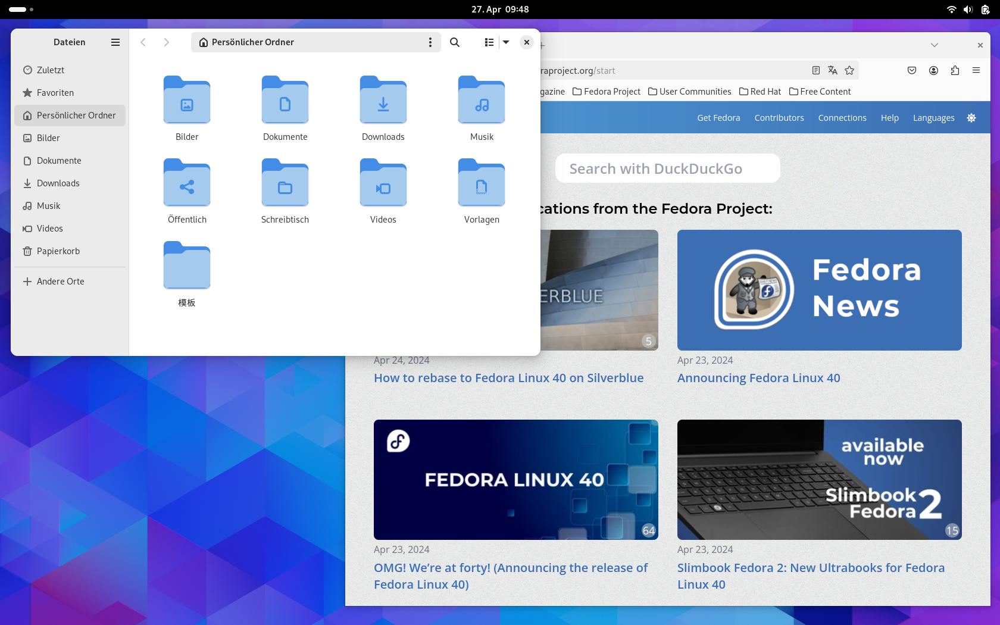

{data-gallery="Gnome"}

GNOME ist eines der populärsten Desktop-Environments in der Linux-Welt und hat sich durch seine klare Designphilosophie und Benutzerfreundlichkeit einen Namen gemacht. Es zielt darauf ab, Einfachheit und Zugänglichkeit für alle Benutzer zu bieten, von Anfängern bis hin zu erfahrenen Nutzern. Wie bei jeder Software gibt es jedoch sowohl Stärken als auch Schwächen, die bei der Bewertung von GNOME berücksichtigt werden müssen.

## Stärken

### 1. Benutzerfreundlichkeit und Einfachheit
GNOME ist für seine saubere und einfache Benutzeroberfläche bekannt. Die Entwickler haben großen Wert darauf gelegt, eine intuitive und leicht verständliche Umgebung zu schaffen. Dies macht es besonders attraktiv für neue Linux-Benutzer, die möglicherweise von komplexeren Desktop-Environments abgeschreckt werden.

### 2. Hohe Anpassbarkeit durch Erweiterungen
Obwohl GNOME in seiner Standardkonfiguration recht minimalistisch ist, lässt es sich durch eine Vielzahl von Erweiterungen stark anpassen. Diese Erweiterungen ermöglichen es Benutzern, Funktionalitäten hinzuzufügen oder das Aussehen und Verhalten des Desktops zu ändern, um ihre persönlichen Bedürfnisse und Vorlieben zu erfüllen.

### 3. Aktive Community und Unterstützung
GNOME hat eine große und aktive Community, die ständig daran arbeitet, das Desktop-Environment zu verbessern und zu erweitern. Dies bedeutet, dass Probleme in der Regel schnell behoben werden und eine Vielzahl von Ressourcen und Hilfestellungen zur Verfügung stehen.

### 4. Integration und Konsistenz
GNOME bietet eine hervorragende Integration mit den GNOME-Anwendungen, die speziell für dieses Environment entwickelt wurden. Dies führt zu einer konsistenten und nahtlosen Benutzererfahrung, bei der Anwendungen und Systemeinstellungen gut miteinander harmonieren.

## Schwächen

### 1. Ressourcenverbrauch
Einer der häufigsten Kritikpunkte an GNOME ist sein relativ hoher Ressourcenverbrauch, insbesondere im Vergleich zu leichtgewichtigeren Alternativen wie XFCE oder LXDE. Benutzer mit älterer oder begrenzter Hardware könnten feststellen, dass GNOME nicht so flüssig läuft, wie sie es wünschen.

### 2. Weniger Flexibilität in der Standardkonfiguration
In seiner Standardkonfiguration bietet GNOME weniger Möglichkeiten zur Anpassung als einige andere Desktop-Environments wie KDE Plasma. Obwohl Erweiterungen viel von dieser Flexibilität zurückbringen können, könnte dies für einige Benutzer, die eine umfangreichere Anpassung out-of-the-box wünschen, ein Nachteil sein.

### 3. Lernkurve für Benutzer, die von anderen Desktops wechseln
Benutzer, die von anderen Desktop-Environments oder Betriebssystemen zu GNOME wechseln, könnten eine Eingewöhnungszeit benötigen, um sich an die einzigartige Art und Weise zu gewöhnen, wie GNOME Arbeitsabläufe und Desktop-Interaktionen handhabt. Die Unterschiede in der Benutzeroberfläche und den Standardtastenkombinationen können anfangs verwirrend sein.

## Fazit

GNOME ist ein leistungsstarkes und benutzerfreundliches Desktop-Environment, das eine saubere und einfache Benutzeroberfläche mit der Möglichkeit zur Erweiterung und Anpassung kombiniert. Während es für seine Eleganz und Zugänglichkeit gelobt wird, könnten sein Ressourcenverbrauch und die anfängliche Lernkurve für einige Benutzer Herausforderungen darstellen. Letztendlich hängt die Entscheidung, ob GNOME das richtige Desktop-Environment für jemanden ist, von den persönlichen Präferenzen, der Hardware und den spezifischen Anforderungen des Benutzers ab.
