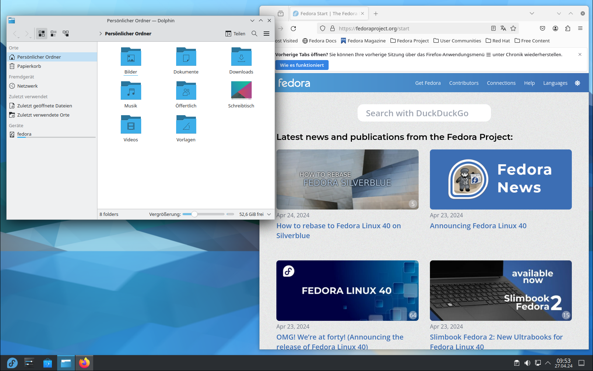

{data-gallery="KDE"}

KDE Plasma ist ein weiteres führendes Desktop-Environment in der Linux-Gemeinschaft, das für seine Flexibilität, Anpassbarkeit und visuelle Anziehungskraft bekannt ist. Es ist das Produkt der KDE-Community, die eine breite Palette von Anwendungen und Frameworks für verschiedene Plattformen entwickelt. KDE Plasma strebt danach, ein modernes, elegantes und komfortables Benutzererlebnis zu bieten, ohne dabei die Leistung zu beeinträchtigen. Wie jedes Softwareprodukt hat auch KDE Plasma seine Stärken und Schwächen.

## :fontawesome-solid-thumbs-up: Stärken

### 1. Hohe Anpassbarkeit
Eine der größten Stärken von KDE Plasma ist seine außergewöhnliche Anpassbarkeit. Benutzer können nahezu jeden Aspekt ihrer Desktop-Umgebung anpassen, von Themen und Icons bis hin zu Widgets und Fensterverhaltensweisen. Diese Flexibilität ermöglicht es Benutzern, eine Arbeitsumgebung zu schaffen, die genau ihren Bedürfnissen und Vorlieben entspricht.

### 2. Visuelle Attraktivität
KDE Plasma ist bekannt für sein ansprechendes Design und seine visuelle Attraktivität. Es bietet eine Vielzahl von Themen, Effekten und Animationen, die nicht nur schön aussehen, sondern auch die Benutzererfahrung verbessern. Die Standardkonfiguration ist bereits ansprechend, aber Benutzer können das Aussehen weiter verfeinern, um eine noch beeindruckendere Desktop-Umgebung zu schaffen.

### 3. Leistungsstark und Ressourceneffizient
Trotz seiner visuellen Komplexität und Anpassbarkeit ist KDE Plasma überraschend ressourceneffizient. Es läuft flüssig auf einer Vielzahl von Hardwarekonfigurationen, einschließlich älterer und weniger leistungsfähiger Systeme. Die Entwickler haben hart daran gearbeitet, sicherzustellen, dass die Schönheit des Desktops nicht auf Kosten der Leistung geht.

### 4. Integriertes Ökosystem
KDE bietet ein umfangreiches Ökosystem an integrierten Anwendungen, die nahtlos mit der Plasma-Desktop-Umgebung zusammenarbeiten. Dieses Ökosystem umfasst alles von Office-Anwendungen bis hin zu Multimedia-Tools, was eine konsistente und integrierte Benutzererfahrung schafft.

## :fontawesome-solid-thumbs-down: Schwächen

### 1. Überwältigende Anpassungsoptionen
Die enorme Anpassbarkeit von KDE Plasma kann für neue oder weniger technisch versierte Benutzer überwältigend sein. Die Fülle an Optionen und Einstellungen kann es schwierig machen, die gewünschten Anpassungen vorzunehmen, ohne sich verloren zu fühlen.

### 2. Gelegentliche Instabilitäten
Obwohl KDE Plasma im Allgemeinen stabil läuft, können die vielen Anpassungsoptionen und Effekte gelegentlich zu Instabilitäten oder Bugs führen, insbesondere nach umfangreichen Anpassungen oder beim Einsatz weniger getesteter Widgets und Erweiterungen.

### 3. Lernkurve
Die Komplexität und der Funktionsumfang von KDE Plasma können eine steilere Lernkurve mit sich bringen, besonders im Vergleich zu einfacheren Desktop-Umgebungen. Neue Benutzer müssen möglicherweise Zeit investieren, um sich mit den verschiedenen Aspekten und Möglichkeiten von Plasma vertraut zu machen.

## Fazit

KDE Plasma ist eine leistungsstarke und schöne Desktop-Umgebung, die eine beispiellose Anpassbarkeit und ein umfangreiches Ökosystem an integrierten Anwendungen bietet. Es ist ideal für Benutzer, die ihre Arbeitsumgebung bis ins kleinste Detail anpassen möchten und bereit sind, sich mit der Komplexität auseinanderzusetzen. Trotz einiger potenzieller Herausforderungen in Bezug auf die Benutzerfreundlichkeit und gelegentliche Instabilitäten bietet KDE Plasma eine der reichhaltigsten und visuell ansprechendsten Erfahrungen auf dem Linux-Desktop.
