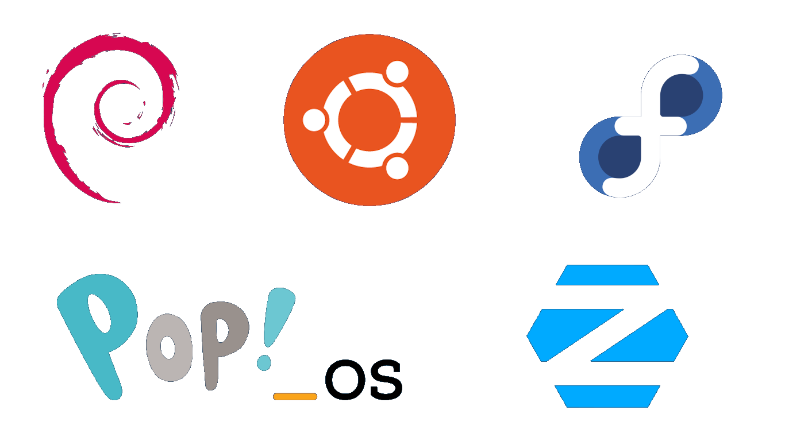

<figure markdown="span" style="background: #2c3c4e">
{data-gallery="distros"}
</figure>

## Linux-Distributionen: Ein Tor zur Welt der offenen Software

Linux, ein Begriff, der in der Welt der Informationstechnologie weit verbreitet ist, steht nicht nur für ein Betriebssystem, sondern für eine Philosophie der Offenheit, der Freiheit und der Gemeinschaft. Im Herzen dieser Bewegung stehen die sogenannten Linux-Distributionen – maßgeschneiderte Sammlungen von Software, die auf dem Linux-Kernel basieren und es jedem ermöglichen, ein System nach seinen Bedürfnissen zu gestalten. In diesem Artikel erkunden wir, was Linux-Distributionen sind, wie sie sich voneinander unterscheiden, und warum sie eine so wichtige Rolle in der Welt der Computertechnologie spielen.

### Was ist Linux?

Um die Bedeutung und die Vielfalt der Linux-Distributionen vollständig zu verstehen, müssen wir zunächst einen Blick auf Linux selbst werfen. Linux ist ein Betriebssystemkernel, das Herzstück, das die Hardware eines Computers mit der Software verbindet. Entwickelt in den frühen 90ern von Linus Torvalds, ist Linux Open Source, was bedeutet, dass sein Quellcode für jeden zugänglich und modifizierbar ist. Diese Offenheit hat eine weltweite Entwicklergemeinschaft inspiriert, die ständig daran arbeitet, den Kernel zu verbessern und anzupassen.

### Was macht eine Linux-Distribution aus?

Eine Linux-Distribution, oft einfach als "Distri" bezeichnet, geht weit über den Kernel hinaus. Es ist eine vollständige Sammlung von Software – bestehend aus dem Linux-Kernel, einer Vielzahl von Anwendungen, einer Benutzeroberfläche und Verwaltungswerkzeugen. Diese Softwarepakete werden von den Entwicklern der Distribution sorgfältig ausgewählt, getestet und zusammengestellt, um sicherzustellen, dass sie gut zusammenarbeiten.

Die wahre Magie der Linux-Distributionen liegt in ihrer Vielfalt. Von Systemen, die für ihre Leichtigkeit und Einfachheit wie Lubuntu oder Xubuntu bekannt sind, bis hin zu denen, die mit der neuesten und größten Software wie Fedora oder openSUSE prahlen – es gibt eine Distribution für fast jeden Zweck und jede Vorliebe.

### Warum gibt es so viele verschiedene Distributionen?

Die Antwort auf diese Frage liegt in der Philosophie von Open Source und der Gemeinschaft, die Linux umgibt. Da der Quellcode für jeden zugänglich ist, kann praktisch jeder eine eigene Version von Linux erstellen, die auf spezifische Bedürfnisse zugeschnitten ist. Dies hat zu einer Explosion von Distributionen geführt, jede mit ihrem eigenen Fokus und ihrer eigenen Gemeinschaft. Einige Distributionen, wie Debian, betonen Stabilität und Zuverlässigkeit, während andere, wie Arch Linux, die neueste Software und vollständige Anpassbarkeit in den Vordergrund stellen.

### Für wen sind sie gedacht?

Einer der größten Vorteile von Linux-Distributionen ist ihre Flexibilität. Sie können ein einfaches, leichtgewichtiges System für ältere Hardware wählen, ein hochsicheres System für Serverbetrieb, ein benutzerfreundliches Desktop-System für den alltäglichen Gebrauch oder sogar ein spezialisiertes System für wissenschaftliche Forschung oder Multimedia-Produktion. Egal, ob Sie ein erfahrener Computerbenutzer oder ein kompletter Neuling sind, es gibt eine Linux-Distribution, die zu Ihren Bedürfnissen passt.

### Fazit

Linux-Distributionen bieten eine atemberaubende Vielfalt und Flexibilität, die in der Welt der Betriebssysteme ihresgleichen sucht. Indem sie die Kraft des Linux-Kernels mit sorgfältig kuratierten Sammlungen von Anwendungen kombinieren, ermöglichen sie es jedem, genau das System zu haben, das sie brauchen – und das oft völlig kostenlos. In einer Zeit, in der die Sorgen um Privatsphäre, Sicherheit und Softwarefreiheit immer lauter werden, bieten Linux-Distributionen eine verlockende Alternative zu den etablierten Betriebssystemen. Tauchen Sie ein in die Welt von Linux und entdecken Sie die Freiheit, Ihr digitales Leben nach Ihren eigenen Regeln zu gestalten.
